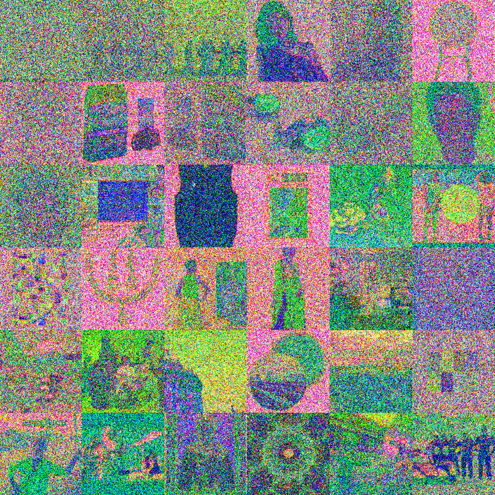

## Consistent Diffusion Meets Tweedie: Training Exact Ambient Diffusion Models with Noisy Data

This repository hosts the official PyTorch implementation of the paper: [Consistent Diffusion Meets Tweedie: Training Exact Ambient Diffusion Models with Noisy Data](https://giannisdaras.github.io/publications/consistent_diffusion_meets_tweedie.pdf).


Authored by: Giannis Daras, Alexandros G. Dimakis, Constantinos Daskalakis

**TLDR**: You can use this repo to finetune state-of-the-art diffusion models (SDXL) with data that is corrupted by additive Gaussian noise. This can be used as a measure to **reduce memorization** of the training set or can be used in applications where the data is inherently noisy.


To train with linearly corrupted data, see Ambient Diffusion ([\[code\]](https://github.com/giannisdaras/ambient-diffusion), [\[paper\]](https://arxiv.org/abs/2305.19256)).


<u> Abstract </u>: *Ambient diffusion is a recently proposed framework for training diffusion models using corrupted data. Both Ambient Diffusion and alternative SURE-based approaches for learning diffusion models from corrupted data resort to approximations which deteriorate performance. We present the first framework for training diffusion models that provably sample from the uncorrupted distribution given only noisy training data, solving an open problem in Ambient diffusion. Our key technical contribution is a method that uses a double application of Tweedie's formula and a consistency loss function that allows us to extend sampling at noise levels below the observed data noise. We also provide further evidence that diffusion models memorize from their training sets by identifying extremely corrupted images that are almost perfectly reconstructed, raising copyright and privacy concerns. Our method for training using corrupted samples can be used to mitigate this problem.
 We demonstrate this by fine-tuning Stable Diffusion XL to generate samples from a distribution using only noisy samples. Our framework reduces the amount of memorization of the fine-tuning dataset, while maintaining competitive performance.*


### Example Training Data


### Generated images:


## Installation

The recommended way to run the code is with an Anaconda/Miniconda environment.
First, clone the repository: 
```
git clone https://github.com/giannisdaras/ambient-tweedie.git
```

Then, create a new Anaconda environment and install the dependencies:

`conda env create -f environment.yaml -n ambient_tweedie`

The next step is to set some environmental variables. For your convenience, you can run the following command:

```bash
source .env
```

Remember to update the `.env` file with the correct paths.


### Download datasets

The experiments in the paper used a subset of the LAION-10k dataset and the FFHQ dataset. You can download all the datasets by running the following script:

```bash
source util_scrips/download_datasets.sh
```
This command will take a few minutes to complete.

Alternatively, you can skip this step and use your own datasets or datasets from `datasets`.

## Attacks

### Noise Attack

```bash
python attack_scripts/attack_with_noise.py --whole_pipeline
```

### Inpainting Attack
```bash
python attack_scripts/attack_with_masking.py --mask_with_yolo
```


## Finetune SDXL

```
accelerate launch train_text_to_image_lora_sdxl.py --config=configs/train_low_level.yaml
```

**Important**: Once the model is trained, add it to `eval_scripts/models_catalog.py`.

## Generate images with finetuned models for FID computation

```bash
torchrun --standalone --nproc_per_node=$GPUS_PER_NODE eval_scripts/generate.py --early_stop_generation --model_key=low_noise
```


## Evaluation

### Evaluate restoration performance
```bash
python eval_scripts/eval_denoisers.py --whole_pipeline
```


### Generate images for FID computation
```bash
```

### Find Nearest Neighbors

#### Noise Attack

#### Inpainting Attack

<!-- ```bash
python filter_results_.py --input_dir=/datastor1/gdaras/sdxl_lora_full_dataset_no_noisecheckpoint-197500_25_early_stop_True/ --output_dir=$BASE_PATH/matches_no_noise --features_path=/datastor1/gdaras/ffhq_features.npy --data=$FFHQ_RAW_DATA --normalize=True
``` -->